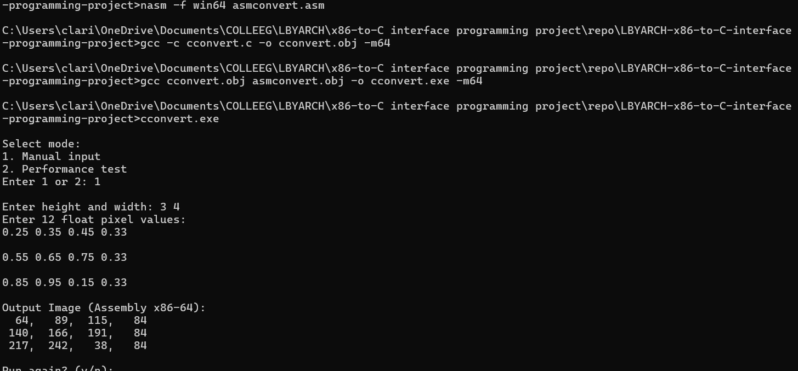
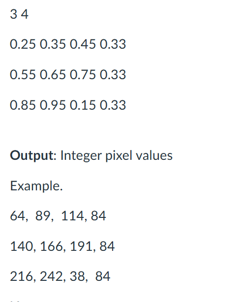

# LBYARCH-x86-to-C-interface-programming-project

Members:
Lamadrid, Kean
Chua Gideon
S17B

To run:
Run the run.bat file

# Execution time and analysis of the performance

Performance Test: 10 x 10
Assembly (x86-64):
Total time: 1.90 microseconds
Average time: 0.06 microseconds
Average time: 0.000063 milliseconds

C Version:
Total time: 5.50 microseconds
Average time: 0.18 microseconds
Average time: 0.000183 milliseconds

Comparison:
Assembly is 2.89x FASTER than C

Performance Test: 100 x 100
Assembly (x86-64):
Total time: 187.00 microseconds
Average time: 6.23 microseconds
Average time: 0.006233 milliseconds

C Version:
Total time: 402.50 microseconds
Average time: 13.42 microseconds
Average time: 0.013417 milliseconds

Comparison:
Assembly is 2.15x FASTER than C

Performance Test: 1000 x 1000
Assembly (x86-64):
Total time: 11679.30 microseconds
Average time: 389.31 microseconds
Average time: 0.389310 milliseconds

C Version:
Total time: 39849.50 microseconds
Average time: 1328.32 microseconds
Average time: 1.328317 milliseconds

Comparison:
Assembly is 3.41x FASTER than C

Assembly is consistently faster
Average speed-up of: (2.89 + 2.15 + 3.41) / 3 = 8.45 / 3 = 2.82x faster than C

# Screenshot of the program output with the correctness check.

Presentation Recording:
https://drive.google.com/file/d/10kaPYXrzxMg8aad669Z_VEXpYeh87-Cu/view?usp=sharing
